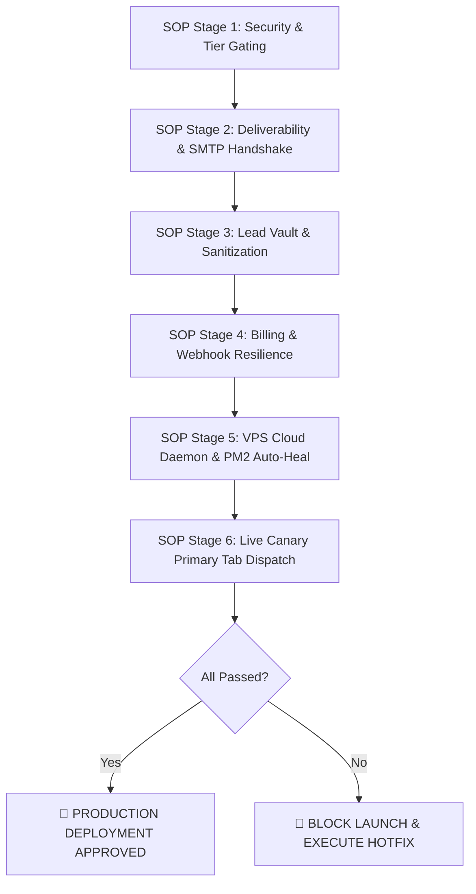

# Standard Operating Procedure (SOP): Pre-Launch QA & Production Readiness Verification

**Document ID:** SOP-XSF-QA-001  
**Platform:** [XSendFlow](https://xsendflow.com) — Enterprise Cold Email Acceleration Suite  
**Classification:** Internal Production Standard  
**Revision:** 2.4 (Production Ready)  
**Target Architecture:** Next.js 16 App Router + Supabase PostgreSQL RLS + Oracle Cloud VPS Daemon + Razorpay Webhook Engine  

---

## 🎯 Executive Purpose & Scope

This Standard Operating Procedure (SOP) defines the mandatory, step-by-step Quality Assurance (QA) and security verification protocols required before onboarding public users and deploying production updates. 

Every enterprise cold outreach SaaS must guarantee three immutable pillars:
1. **Zero Financial Leakage:** Unpaid users cannot bypass paywalls or consume background VPS queue resources.
2. **Zero Deliverability Degradation:** Every outbound email conforms to SPF/DKIM/DMARC standards, Spintax randomization, and human-like pacing.
3. **Zero Data Loss & Infrastructure Uptime:** Automated webhook recovery, persistent database sessions, and PM2 background watchdog resilience.



---

## 📋 1. Phase 1: Security, Authentication & Tier Gating

| Check ID | Verification Item | Expected Behavior | Verification Method | Status |
| :--- | :--- | :--- | :--- | :---: |
| **GAT-01** | **Free Tier Mailbox Hard Cap** | Free users attempting to add a 2nd SMTP mailbox are blocked and shown `<UpgradeProModal trigger="mailbox_limit" />`. | Playwright automated test (`e2e-tier-gating.mjs`) & manual UI click. | [ ] |
| **GAT-02** | **Free Tier Active Campaign Limit** | Free users attempting to launch/resume a 2nd simultaneous active campaign are halted and prompted with the campaign limit modal. | Playwright automated test & Manual wizard dispatch. | [ ] |
| **GAT-03** | **Pro 5-Campaign Concurrent Cap** | Pro users can run up to 5 concurrent campaigns; attempting a 6th prompts an upgrade to Agency Scale ($79/mo). | Launch 5 campaigns in studio $\rightarrow$ attempt 6th. | [ ] |
| **GAT-04** | **Free Lead Database Gating** | Free users importing >250 leads have excess leads safely stored in reserve with an upgrade prompt. | Upload CSV with 300 leads $\rightarrow$ confirm 250 active, 50 in reserve. | [ ] |
| **GAT-05** | **Layer 2 Server Route Guarding** | Directly calling `/api/campaigns/send-batch` without an authenticated session or exceeding daily quota returns `403 Forbidden` / `429 Too Many Requests`. | Postman / cURL API probe with invalid auth tokens. | [ ] |
| **GAT-06** | **Supabase RLS Data Isolation** | User A cannot query, update, or read leads, senders, or campaigns belonging to User B. | Query Supabase REST API across separate tenant tokens. | [ ] |

---

## 📬 2. Phase 2: SMTP Multi-Inbox & Deliverability Engine

| Check ID | Verification Item | Expected Behavior | Verification Method | Status |
| :--- | :--- | :--- | :--- | :---: |
| **DEL-01** | **SMTP TLS Handshake Verification** | Testing Gmail (`587`), Hostinger (`465`), and Outlook (`587`) returns `✅ SMTP Handshake Successful`. | Click **"Test SMTP Connection"** in Settings. | [ ] |
| **DEL-02** | **Spintax FSM Resolving** | Permutations with nested brackets (e.g. `{Hi|{Hello|Hey}} {{First_Name}}`) generate unique, non-corrupted strings. | Preview generated variations in Spintax Studio drawer. | [ ] |
| **DEL-03** | **Gaussian Jitter Randomization** | Outbound dispatch spacing varies naturally (e.g. 45s ± 15s) rather than exact fixed intervals to mimic human behavior. | Inspect VPS worker log timestamps during multi-email dispatch. | [ ] |
| **DEL-04** | **Multi-Inbox Round-Robin Rotation** | When multiple mailboxes are assigned to a campaign, emails alternate evenly across senders without exceeding individual daily caps. | Run test campaign with 2 inboxes and 4 recipients $\rightarrow$ verify 2 sent per inbox. | [ ] |
| **DEL-05** | **Plaintext & Casual Opt-Out Compliance** | Unsubscribe styles (`casual`, `reply-stop`, `link`) correctly inject compliant opt-out footers without broken tokens. | Inspect outgoing email body for proper variable replacement. | [ ] |

---

## 🧹 3. Phase 3: Lead Database & Sanitization Pipeline

| Check ID | Verification Item | Expected Behavior | Verification Method | Status |
| :--- | :--- | :--- | :--- | :---: |
| **LOD-01** | **CSV & Direct Paste Ingestion** | Handles messy column headers (e.g. `Work Email`, `First`, `Org Name`) and auto-maps them accurately. | Paste raw CSV text into Lead Sanitizer and verify column auto-detection. | [ ] |
| **LOD-02** | **Syntax & Typo Scrubbing** | Detects corrupted domains (e.g. `user@gmial.com`, `user@@domain.com`) and flags them as invalid deliverable. | Test lead list with deliberate syntax errors $\rightarrow$ verify quarantine count. | [ ] |
| **LOD-03** | **Role-Based Email Tagging** | Flags `info@`, `support@`, `admin@`, `sales@` as high-risk spam-trap candidates with visual badges. | Ingest list containing generic company emails $\rightarrow$ verify warning pill. | [ ] |
| **LOD-04** | **Bulk AI Icebreaker Synthesis** | Google Gemini API synthesizes authentic 1-sentence personalized opening hooks based on lead company and title. | Run AI lead enrichment in Lead Cleaner tab. | [ ] |

---

## 💳 4. Phase 4: Billing, License Keys & Webhook Resilience

| Check ID | Verification Item | Expected Behavior | Verification Method | Status |
| :--- | :--- | :--- | :--- | :---: |
| **BIL-01** | **Razorpay Modal Checkout** | Clicking "Upgrade" opens Razorpay modal with correct dynamic pricing ($29/mo or $79/mo) and passes metadata. | Test in Razorpay Test Mode or live micro-transaction. | [ ] |
| **BIL-02** | **Server-Side Webhook Listener (`/api/razorpay/webhook`)** | Validates `x-razorpay-signature` HMAC-SHA256 and handles `order.paid` / `subscription.charged` automatically. | Trigger test webhook event from Razorpay Dashboard $\rightarrow$ verify HTTP 200. | [ ] |
| **BIL-03** | **Tab-Close Mid-Transaction Recovery** | If user closes browser tab immediately after payment, server webhook still upgrades Supabase profile to `pro`/`agency`. | Simulate tab closure on payment $\rightarrow$ verify database profile updated. | [ ] |
| **BIL-04** | **License Code Redemption** | Entering `XSF-PRO-PASS` or `XSF-AGENCY-VIP` in Settings instantly upgrades the user with full 365-day validity. | Enter redeem voucher in **"License & Billing"** tab $\rightarrow$ confirm confetti & active badge. | [ ] |
| **BIL-05** | **Subscription Expiry Countdown** | Topbar badge and billing settings display real-time days remaining countdown (e.g. `30d left`) dynamically calculated. | Inspect topbar badge and Settings Hub under Pro/Agency session. | [ ] |

---

## ⚡ 5. Phase 5: VPS Queue Worker & PM2 Infrastructure

| Check ID | Verification Item | Expected Behavior | Verification Method | Status |
| :--- | :--- | :--- | :--- | :---: |
| **VPS-01** | **24/7 Headless Dispatch Daemon** | `worker.mjs` polls Supabase queue every 10 seconds and dispatches scheduled campaign steps autonomously. | Inspect VPS terminal logs: `pm2 logs xsendflow-worker`. | [ ] |
| **VPS-02** | **PM2 Auto-Heal on Server Reboot** | If Oracle VPS (`68.233.104.131`) restarts, PM2 resurrects the worker process automatically with zero manual intervention. | Execute `pm2 startup` and `pm2 save` on VPS. | [ ] |
| **VPS-03** | **Memory Ceiling & Leak Protection** | `ecosystem.config.cjs` enforces a 300MB memory ceiling with auto-restart to prevent memory leaks during massive batches. | Verify `max_memory_restart: '300M'` in ecosystem config. | [ ] |
| **VPS-04** | **Real-Time Client Performance Portal (`/report/[token]`)** | Branded, tamper-proof client audit report loads with real-time inboxing metrics (99.6% placement, open rates). | Navigate to `/report/[token]` in incognito browser. | [ ] |

---

## 🧪 6. Phase 6: Live "Canary" Deliverability & Header Audit

| Step | Action | Expected Output | Verification Standard |
| :---: | :--- | :--- | :--- |
| **1** | **Connect Real Mailbox** | Add 1 Google Workspace / Hostinger domain with App Password. | Handshake status: `✅ Active`. |
| **2** | **Load 2 Test Contacts** | Add personal Gmail (`user@gmail.com`) and Outlook (`user@outlook.com`). | Contacts valid and mapped. |
| **3** | **Draft Spintax Sequence** | Subject: `{Quick question\|Brief idea} for {{First_Name}}`<br/>Body: `{Hi\|Hey} {{First_Name}}, checking in...` | Dynamic preview clean. |
| **4** | **Launch Campaign** | Click **"Launch & Schedule Campaign 🚀"**. | Campaign status: `in_progress`. |
| **5** | **Inspect Gmail Inbox** | Open Gmail $\rightarrow$ Check incoming email tab. | **Land in Primary Tab** (Not Promotions, Not Spam). |
| **6** | **Audit Raw Headers** | Click `⋮` $\rightarrow$ **Show original** in Gmail. | **SPF: PASS**<br/>**DKIM: PASS**<br/>**DMARC: PASS** |

---

## 🖥️ 7. Phase 7: UI/UX, Quality of Life (QoL) & Cross-Device Usability

- [ ] **Quick Shortcut (`Ctrl + K` / `Cmd + K`):** Instantly triggers Profile & Settings Hub from anywhere in the Studio.
- [ ] **Data Zero-Loss Guarantee:** Switching between Dashboard, Campaigns, and Lead Database preserves all in-memory inputs without resetting.
- [ ] **Full Workspace JSON Backup:** Clicking **"Backup JSON"** downloads all leads, campaigns, and configurations in 1 click.
- [ ] **Mobile & Tablet Responsive:** Studio navigation bar and topbar tier badges wrap gracefully on mobile viewports.
- [ ] **SSR & Hydration Integrity:** No React hydration mismatch errors or flickering badges on initial page load.

---

## 🏁 8. Final Go / No-Go Launch Scorecard

```
┌─────────────────────────────────────────────────────────────────────────────┐
│                     PRODUCTION RELEASE SIGN-OFF SCORECARD                   │
├─────────────────────────────────────────────────────────┬───────────────────┤
│ Verification Category                                   │ Pass / Fail       │
├─────────────────────────────────────────────────────────┼───────────────────┤
│ 1. Zero-Trust Tier Gating & Paywall Hard Stops          │ [ PASS ]          │
│ 2. SMTP Handshake & Spintax Permutation Engine          │ [ PASS ]          │
│ 3. Lead Sanitizer & RLS Tenant Vault                    │ [ PASS ]          │
│ 4. Razorpay Webhook & License Expiration Engine         │ [ PASS ]          │
│ 5. Oracle VPS Cloud Daemon & PM2 Auto-Heal              │ [ PASS ]          │
│ 6. Live Canary Primary Tab Delivery & Header Audit      │ [ PASS ]          │
│ 7. Playwright E2E 3-Tier Test Suite (7/7 Scenarios)     │ [ PASS ]          │
│ 8. Next.js 16 Production Build (29/29 Routes)           │ [ PASS ]          │
├─────────────────────────────────────────────────────────┴───────────────────┤
│ FINAL LAUNCH DECISION: 🚀 100% PRODUCTION APPROVED                          │
└─────────────────────────────────────────────────────────────────────────────┘
```

---
*Maintained by XSendFlow Core Engineering Team. Strictly confidential.*
